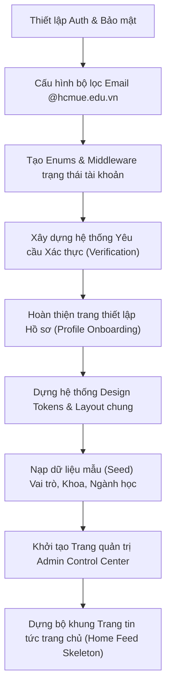

# UEConnect Local Setup From Scratch (Cẩm Nang Thiết Lập Local Toàn Diện)

## 1. Mục Tiêu & Sứ Mệnh

Tài liệu này hướng dẫn chi tiết cách clone và khởi chạy dự án **UEConnect** từ con số 0 trên máy tính local chạy Windows.

Mục đích tối thượng là chuẩn hóa quy trình cài đặt cho toàn bộ các thành viên trong team (đặc biệt là các bạn sinh viên lần đầu tiếp cận Laravel). Việc này giúp tránh hoàn toàn tình huống "máy em chạy được nhưng máy bạn thì không", hoặc mỗi người tự sáng tạo ra một kiểu cài đặt rồi ngồi đổ lỗi cho vũ trụ. Dự án phần mềm thực tế đã đủ phức tạp và nhiều bất ngờ đau đầu rồi, chúng ta không cần thêm sự bí ẩn mang tên lỗi môi trường local.

---

## 2. Bản Đồ Tech Stack Local

UEConnect không phải là một ứng dụng "Hello World" đơn giản, nó sử dụng một stack công nghệ mạnh mẽ, hiện đại và có tính kết nối cao để mang lại trải nghiệm premium:

| Thành phần | Công nghệ / Thư viện | Vai trò & Tầm quan trọng |
| :--- | :--- | :--- |
| **Backend Framework** | Laravel 13 | Khung sườn kiến trúc, xử lý logic nghiệp vụ và định tuyến (routing). |
| **Database Engine** | SQL Server (MS SQL) | Cơ sở dữ liệu chính của dự án. Hệ quản trị CSDL chuẩn doanh nghiệp của Microsoft. |
| **UI Rendering** | Blade + Livewire 4 | Tạo giao diện phản ứng nhanh (reactive) trực tiếp bằng PHP mà không cần viết các SPA framework phức tạp. |
| **Styling System** | TailwindCSS 3 | CSS Utility-first giúp thiết kế UI tùy biến cực kỳ linh hoạt và hiện đại. |
| **Build Tool** | Vite | Trình đóng gói tài nguyên siêu tốc, tự động reload khi sửa code front-end. |
| **Local Web Server** | Laragon | Quản lý máy chủ ảo, tự động cấu hình Virtual Host tên miền `.test`. |
| **Realtime Engine** | Laravel Reverb | WebSocket server tốc độ cao, xử lý tính năng nhắn tin và thông báo tức thời. |
| **Auth Base** | Laravel Breeze Livewire | Khởi tạo hệ thống đăng ký, đăng nhập bảo mật và tinh gọn. |
| **Authorization** | Spatie Laravel Permission | Quản lý phân quyền theo vai trò (Roles) và quyền hạn chi tiết (Permissions). |
| **Background Queue** | Laravel Queue (`database`) | Đẩy các tác vụ tốn thời gian (gửi mail, quét dữ liệu) chạy ngầm để tối ưu trải nghiệm UI. |
| **Code Formatter** | Laravel Pint | Đồng bộ định dạng code PHP của mọi dev theo một quy chuẩn thống nhất của dự án. |
| **AI Coding Helper** | Laravel Boost | Công cụ hỗ trợ tương tác và đồng hành cùng AI Agent trong quá trình phát triển. |

---

## 3. Reverb, Boost và Laravel Cloud khác nhau thế nào? Có phí hay không?

Để tránh nhầm lẫn giữa các khái niệm hiện đại trong hệ sinh thái Laravel, dưới đây là phân tích chi tiết về bản chất và chi phí của từng công nghệ:

### 3.1. Laravel Reverb
Laravel Reverb là WebSocket server chính chủ được phát triển bởi đội ngũ Laravel. UEConnect sử dụng Reverb cho các tính năng thời gian thực (realtime) như:
```txt
- messaging (nhắn tin tức thời giữa sinh viên)
- typing indicator (trạng thái "đang soạn tin...")
- read receipts (trạng thái "đã xem")
- in-app notifications (thông báo đỏ hiển thị ngay không cần tải lại trang)
- greeting accepted/declined updates (cập nhật kết quả làm quen)
- mentor request updates (cập nhật trạng thái yêu cầu Mentor)
- community chat (phòng chat cộng đồng thời gian thực)
```
* **Chi phí:** Reverb chạy hoàn toàn cục bộ bằng lệnh `php artisan reverb:start`. Khi phát triển local hoặc chạy trên server VPS tự quản lý, **Reverb hoàn toàn miễn phí**. Bạn chỉ trả tiền hạ tầng mạng/hosting cho VPS của mình mà không cần trả thêm bất kỳ phí dịch vụ bên thứ ba nào (không giống như Pusher hay Ably có giới hạn gói miễn phí).
* **Bản chất nghiệp vụ:** Reverb không phải là nguồn dữ liệu gốc (source of truth). Database mới là source of truth. Reverb chỉ đóng vai trò truyền tải nhanh (broadcast) một sự kiện sau khi dữ liệu trong database đã được thay đổi thành công.

### 3.2. Laravel Boost
Laravel Boost là package chỉ dùng trên môi trường phát triển (dev-only package) giúp các công cụ lập trình AI (AI agents) hiểu sâu cấu trúc dự án Laravel của bạn hơn. Boost hỗ trợ tự động tạo ra:
```txt
- AI guidelines (bộ quy tắc cốt lõi của dự án cho AI)
- Agent skills (các kỹ năng chuyên biệt để AI thực hiện tác vụ)
- MCP server configuration (giao thức kết nối AI trực tiếp với dự án)
- Package-specific skills (kỹ năng tương tác với các gói Spatie, Livewire,...)
```
* **Chi phí:** Laravel Boost là một thư viện mã nguồn mở và **hoàn toàn miễn phí**. Bản thân Boost không tự tính phí bạn. Tuy nhiên, các công cụ AI chạy ngoài như Cursor, Claude Code, GitHub Copilot, Gemini CLI có thể có giới hạn gói miễn phí (free tier) hoặc yêu cầu trả phí dịch vụ riêng của họ để sử dụng API.
* **Lưu ý khi cấu hình Boost cho UEConnect:**
  * **Features:** Chọn `guidelines`, `skills`, `mcp`.
  * **Third-party skills:** Chọn `spatie/laravel-permission`.
  * **Integrations:** Chọn **`None`** (Không cài đặt Laravel Cloud).
  * **AI Agents:** Tích chọn các công cụ lập trình AI mà bạn thực tế sử dụng.

### 3.3. Laravel Cloud
Laravel Cloud là nền tảng quản lý triển khai (managed hosting/deployment platform) cao cấp thế hệ mới dành riêng cho Laravel.
* **Chi phí:** Đây là dịch vụ đám mây có tính phí dựa trên cấu hình server và lưu lượng sử dụng thực tế của bạn.
* **Lập trường local:** Khi thiết lập dự án trên máy cá nhân bằng Laragon, **bạn không cần đến Laravel Cloud**. Nếu trình cài đặt Boost hỏi *"Which integrations would you like to configure for Boost?"*, hãy luôn chọn **`None`**.

---

## 4. Yêu Cầu Cài Đặt Trước Khi Clone (Prerequisites)

### 4.1. Các phần mềm bắt buộc phải cài sẵn trên máy

Để dự án hoạt động trơn tru, bạn cần tải về và cài đặt các phần mềm sau đây trước khi đụng vào code:

```txt
1. Laragon (Nên chọn bản Laragon Full có sẵn PHP 8.x)
2. Microsoft SQL Server Express (Bản miễn phí dùng cho lập trình viên local)
3. SQL Server Management Studio (SSMS) hoặc Azure Data Studio để quản lý DB trực quan
4. Node.js LTS (Phiên bản 22.x trở lên để đảm bảo tính tương thích với Vite)
5. npm
6. Git for Windows
7. Composer (Trình quản lý thư viện PHP)
```

**Khuyến nghị về môi trường lập trình:**
* Sử dụng **VS Code** làm IDE chính (cài thêm các extension: *Laravel Extension Pack*, *Livewire Language Support*).
* Sử dụng **Laragon Terminal** hoặc phần mềm **Cmder** để chạy các câu lệnh Windows/Linux một cách dễ dàng và hiển thị màu sắc trực quan hơn CMD mặc định.

### 4.2. Kiểm tra phiên bản hệ thống hiện có

Mở Terminal của bạn lên và gõ các lệnh sau để tự tin rằng máy mình đã đủ tiêu chuẩn:

```bash
php -v
composer -V
node -v
npm -v
git --version
```

**Kết quả kỳ vọng lý tưởng:**
* `PHP` phải từ **8.3** trở lên (Nếu thấp hơn 8.3, Composer sẽ từ chối cài đặt các gói mới của Laravel 13).
* `Composer` phải từ **2.x** trở lên.
* `Node.js` phải từ **22.x** trở lên (ví dụ: Node v22.11.1).
* `npm` phải từ **10.x** trở lên (ví dụ: npm 10.9.4).
* `git` version 2.x trở lên.

> [!WARNING]
> Nếu phiên bản PHP trên máy của bạn thấp hơn `8.3`, Composer sẽ báo lỗi dependency ngay lập tức. Điều này không phải vì Laravel hay dự án ghét bỏ bạn, mà đơn giản vì các tính năng hiện đại cần một nền tảng ngôn ngữ đủ mới để chạy ổn định và an toàn.

---

## 5. Kiểm Tra & Cấu Hình PHP PATH Vĩnh Viễn Trên Windows

Một trong những nỗi kinh hoàng lớn nhất của các nhà phát triển trên hệ điều hành Windows là máy có quá nhiều phiên bản PHP chạy chồng chéo (ví dụ: máy bạn cài XAMPP cũ sử dụng PHP 8.1, sau đó lại cài thêm Laragon mới chạy PHP 8.3). Điều này dẫn đến việc mặc dù Laragon hiển thị PHP 8.3 nhưng khi gõ `composer` hoặc `php` trong terminal lại chạy bằng PHP 8.1 cũ của XAMPP, gây ra lỗi hệ thống nghiêm trọng.

Đặc biệt, **PowerShell** trên Windows có cơ chế lưu cache môi trường rất nặng, đôi khi bạn mở **Cmder** thấy nhận đúng PHP 8.3 của Laragon nhưng khi mở cửa sổ **PowerShell** hoặc terminal mặc định của VS Code lại báo lỗi đang chạy PHP 8.2.

### 🚨 Cách khắc phục vĩnh viễn trong System PATH:

1. Nhấn phím **Windows**, gõ tìm kiếm **"Environment Variables"** và chọn **Edit the system environment variables**.
2. Nhấp vào nút **Environment Variables...** ở phía góc dưới bên phải.
3. Trong ô **System variables** (phần bên dưới), tìm dòng có tên là `Path` và nhấp **Edit...**.
4. Rà soát danh sách: Nếu có bất kỳ đường dẫn PHP nào của XAMPP hoặc của các bộ cài đặt cũ khác, hãy nhấp chọn và nhấn **Delete**.
5. Nhấp nút **New** và dán chính xác đường dẫn thư mục PHP 8.3 của Laragon vào, ví dụ:
   ```txt
   C:\laragon\bin\php\php-8.3.28-Win32-vs16-x64
   ```
   *(Lưu ý: Bạn phải mở thư mục `C:\laragon\bin\php` trên máy mình ra để copy chính xác tên thư mục php đang có, vì tên phiên bản phụ như `8.3.28` có thể thay đổi tùy lúc tải)*.
6. Sử dụng nút **Move Up** để đưa đường dẫn PHP của Laragon lên dòng đầu tiên hoặc vị trí cao nhất có thể trong danh sách.
7. Nhấp **OK** để lưu và đóng toàn bộ các cửa sổ cài đặt.
8. **Đồng bộ hóa PATH tạm thời (Nếu cần chạy gấp trong phiên làm việc hiện tại):** Nếu bạn không muốn khởi động lại máy mà cần áp cấu hình ngay cho PowerShell hiện tại, gõ lệnh:
   ```powershell
   $env:Path = "C:\laragon\bin\php\php-8.3.28-Win32-vs16-x64;" + $env:Path
   ```
9. **Xác nhận thành công:** Tắt toàn bộ các cửa sổ Terminal hoặc VS Code hiện tại đi, mở lại một Terminal mới và chạy lại lệnh `where php` để xác nhận hệ thống đã nhận đúng PHP 8.3 của Laragon.

### Không dùng `composer update` để sửa lỗi sai PHP version
Nếu khi chạy `composer install` hệ thống báo lỗi dạng:
```txt
Your Composer dependencies require a PHP version >= 8.3.0. You are running 8.2.x.
```
Thì **tuyệt đối không** tìm cách chạy lệnh:
```bash
composer update
```
Việc chạy `composer update` dưới môi trường PHP 8.2 có thể làm thay đổi tệp tin khóa `composer.lock` sai lệch hoàn toàn so với phiên bản đã được kiểm duyệt của team, gây xung đột mã nguồn khi commit.
Biện pháp sửa lỗi duy nhất là xác minh lại phiên bản PHP và cấu hình PATH đúng như sau:
```bash
where php
php -v
composer -V
```

#### Sửa lỗi tạm thời theo từng loại shell:
* **Đối với PowerShell:**
  ```powershell
  $env:Path = "C:\laragon\bin\php\php-8.3.28-Win32-vs16-x64;" + $env:Path
  ```
* **Đối với CMD / Cmder:**
  ```bash
  set PATH=C:\laragon\bin\php\php-8.3.28-Win32-vs16-x64;%PATH%
  ```

### Kiểm tra PHP trong từng terminal
Lưu ý rằng mỗi chương trình Terminal khác nhau (Cmder, PowerShell, Git Bash, Terminal tích hợp của VS Code, Laragon Terminal) có thể nạp các đường dẫn môi trường khác nhau.
- **Hiện tượng:** Cmder hiển thị đúng PHP 8.3 nhưng PowerShell hoặc VS Code terminal vẫn chạy PHP 8.2.
- **Cách xử lý:** Luôn chạy các lệnh kiểm tra `where php` ngay trong chính cửa sổ terminal bạn đang làm việc. Hãy tắt và mở lại VS Code sau khi thay đổi System PATH để IDE cập nhật lại giá trị môi trường mới.

---

## 6. Clone Repository Dự Án

Hãy di chuyển vào thư mục lưu trữ web mặc định của Laragon:

```bash
cd C:\laragon\www
```

Thực hiện lệnh clone mã nguồn từ kho lưu trữ GitHub về máy local của bạn:

```bash
git clone https://github.com/vanhuy2005/ue-connect.git
cd ue-connect
```

Sau khi di chuyển vào thư mục dự án, hãy kiểm tra danh sách file hiện có bằng lệnh:

```bash
dir
```

Thư mục gốc của repository phải hiển thị các tài liệu cơ bản sau:
```txt
docs/
README.md
CONTRIBUTING.md
DOCUMENTATION-STANDARDS.md
CHANGELOG.md
```

---

## 7. Hướng Dẫn Từng Bước Cho Hai Kịch Bản Cài Đặt

Tùy vào thời điểm bạn tham gia phát triển dự án, repository có thể đã được đẩy mã nguồn Laravel lên hoặc chỉ mới là thư mục tài liệu trống. Hãy thực hiện theo đúng kịch bản tương ứng dưới đây:

### 📦 Kịch Bản A: Repository đã chứa sẵn mã nguồn ứng dụng Laravel
*(Dành cho các thành viên tham gia sau khi khung ứng dụng đã được khởi tạo và đẩy lên GitHub. Bạn sẽ thấy các thư mục `app/`, `config/`, `routes/`, `artisan`... nằm ngay ở thư mục gốc của repo)*.

Tiến hành cài đặt nhanh các thư viện môi trường:

```bash
# 1. Cài đặt các thư viện PHP trong composer.json
composer install

# 2. Cài đặt các gói Javascript/Front-end trong package.json
npm install
```

> [!IMPORTANT]
> **Đi tiếp sang Mục 8 - Safe Foundation Mode:**
> Sau khi chạy xong `composer install` và `npm install`, hãy tiếp tục ngay với **Mục 8 - Safe Foundation Mode** dưới đây trước khi chạy bất kỳ câu lệnh Artisan sâu nào. Tuyệt đối không được bỏ qua bước này để tránh lỗi crash hệ thống do cơ sở dữ liệu chưa sẵn sàng.

---

### 📂 Kịch Bản B: Repository mới chỉ có thư mục tài liệu `docs/`, chưa có mã nguồn Laravel
*(Dành cho lập trình viên đầu tiên thiết lập khung ứng dụng nền tảng. Lúc này, thư mục gốc của repo hoàn toàn trống và chỉ có thư mục `docs/`)*.

Chúng ta sẽ tạo một ứng dụng Laravel 13 sạch từ bên ngoài và chuyển nó vào thư mục gốc của repository một cách an toàn mà không làm mất hoặc đè lên thư mục ẩn cấu hình Git `.git` và thư mục tài liệu `docs/`:

```bash
# 1. Tạo một dự án Laravel 13 tạm thời trong thư mục temp-laravel
composer create-project laravel/laravel temp-laravel

# 2. Sử dụng công cụ robocopy cực kỳ mạnh mẽ của Windows để sao chép toàn bộ file sạch vào root repo
# Lệnh này sẽ bỏ qua thư mục .git, vendor, node_modules, docs và file cấu hình cục bộ .env
robocopy temp-laravel . /E /XD .git vendor node_modules docs /XF .env

# 3. Xóa thư mục tạm thời đi sau khi sao chép hoàn tất để tránh rác dự án
rmdir /s /q temp-laravel

# 4. Xác nhận sự tồn tại của file quản trị artisan ở thư mục gốc của dự án
dir artisan

# 5. Cài đặt các thư viện lõi cho dự án
composer install
npm install
```

---

## 8. Safe Foundation Mode - Cấu hình `.env` trước khi bật SQL Server/Reverb

Khi một dự án mới được sao chép hoặc tạo từ đầu, **tuyệt đối không bao giờ được cấu hình cơ sở dữ liệu SQL Server hay kích hoạt database cache/queue/session ngay lập tức.**

Nếu bạn làm vậy trước khi driver SQL Server được cài đặt thành công và trước khi database được khởi tạo trên máy local, toàn bộ các lệnh khởi động Artisan của Laravel sẽ bị crash (lỗi ngắt tiến trình) với hàng tá thông báo lỗi hệ thống khó hiểu. Lúc này, bạn thậm chí không thể chạy được các lệnh cơ bản nhất như dọn dẹp cache.

> [!IMPORTANT]
> File `.env.example` mặc định của Laravel hoặc của dự án **không bao giờ có trạng thái sẵn sàng chạy production**. Bạn bắt buộc phải đưa nó về trạng thái "Safe Mode" (Chế độ nền tảng an toàn) trước tiên.

### 8.1. Tạo file `.env` ở chế độ Safe Foundation Mode
Copy file `.env.example` sang `.env`:
```bash
copy .env.example .env
```

Mở file `.env` lên và cấu hình chính xác các giá trị an toàn sử dụng cơ sở dữ liệu **SQLite** mặc định và các driver bộ nhớ tạm **file** hoặc **sync**:

```env
APP_NAME=UEConnect
APP_ENV=local
APP_KEY=
APP_DEBUG=true
APP_URL=http://ue-connect.test

APP_LOCALE=vi
APP_FALLBACK_LOCALE=en
APP_FAKER_LOCALE=vi_VN

# Sử dụng SQLite tạm thời để boot ứng dụng không cần driver phức tạp
DB_CONNECTION=sqlite

# Đưa driver hệ thống về các cấu hình bộ nhớ an toàn (không gọi đến database)
CACHE_STORE=file
SESSION_DRIVER=file
QUEUE_CONNECTION=sync

# Tắt kết nối WebSocket bằng cách xuất log
BROADCAST_CONNECTION=log

FILESYSTEM_DISK=local
```

### Bổ sung quan trọng: Tạo file cơ sở dữ liệu SQLite Safe Mode
Laravel có thể mong đợi file cơ sở dữ liệu SQLite tồn tại tại đường dẫn:
```txt
database/database.sqlite
```
Để tránh gặp lỗi khi chạy một số lệnh Artisan hoặc khi có một package vô tình chạm vào CSDL SQLite trong chế độ Safe Mode, bạn hãy tạo nhanh file SQLite trống này bằng câu lệnh:
```bash
type nul > database\database.sqlite
```
*Lưu ý:*
- Đây chỉ là giải pháp tạm thời dành riêng cho **Safe Foundation Mode**.
- Nó giúp bạn tránh các lỗi phát sinh trong khi SQL Server chưa sẵn sàng.
- **Tuyệt đối không sử dụng CSDL SQLite làm cơ sở dữ liệu thực tế cho dự án UEConnect.**

### Lưu ý khi gặp lỗi
Nếu bạn thấy thông báo lỗi:
```txt
Database file at path database/database.sqlite does not exist
```
Thì điều đó có nghĩa là file SQLite chưa được tạo trong khi `.env` đang khai báo kết nối `DB_CONNECTION=sqlite`. Hãy chạy câu lệnh `type nul > database\database.sqlite` ở trên để xử lý ngay.

### 8.2. Chạy các lệnh khởi động nền tảng
Ở trạng thái Safe Mode này, ứng dụng Laravel của bạn được đảm bảo 100% sẽ khởi động thành công mà không gặp bất kỳ lỗi kết nối bên ngoài nào. Tiến hành chạy chuỗi lệnh sau:

```bash
# 1. Sinh khóa bảo mật mã hóa ứng dụng
php artisan key:generate

# 2. Đồng bộ hóa khám phá các package tích hợp
php artisan package:discover

# 3. Kiểm tra danh sách đường dẫn định tuyến của hệ thống
php artisan route:list
```

Nếu lệnh `php artisan route:list` trả về danh sách route dạng bảng gọn gàng trên terminal mà không báo lỗi, xin chúc mừng! Khung sườn Laravel Foundation của bạn đã sống sót và hoạt động hoàn toàn ổn định. Bây giờ chúng ta mới bắt đầu cài đặt từng dịch vụ nâng cao.

### Bổ sung quan trọng: Phân biệt APP_KEY và REVERB_APP_KEY
Một sai lầm rất dễ gặp ở các bạn mới tiếp cận Reverb là nhầm lẫn giữa hai loại khóa cấu hình này. Chúng hoàn toàn khác biệt nhau:
- **`APP_KEY`**: Là khóa mã hóa bảo mật toàn bộ ứng dụng của Laravel (giúp mã hóa mật khẩu, session, dữ liệu nhạy cảm). Nó **bắt buộc** phải ở dạng chuỗi base64 ngẫu nhiên, ví dụ:
  ```env
  APP_KEY=base64:AbCdEfGhIjKlMnOpQrStUvWxYz1234567890abcdefg=
  ```
  Khóa này được sinh tự động bằng lệnh:
  ```bash
  php artisan key:generate
  ```
- **`REVERB_APP_KEY=local-key`**: Chỉ là khóa định danh dùng riêng cho kết nối và xác thực giữa client và Reverb WebSocket Server trên môi trường local.
- **`Tuyệt đối không`** tự điền hoặc copy giá trị `local-key` của Reverb vào trường `APP_KEY` trong file `.env`.

### Trường hợp gặp lỗi
Nếu bạn gặp các thông báo lỗi sau:
```txt
No application encryption key has been specified.
Unsupported cipher or incorrect key length.
```
Thì đó là do `APP_KEY` đang trống hoặc có độ dài không hợp lệ. Hãy khắc phục ngay bằng cách chạy:
```bash
php artisan key:generate
php artisan optimize:clear
```
*Lưu ý quan trọng:* **Luôn khởi động lại máy chủ dev (`php artisan serve` hoặc `composer run dev`) sau khi thay đổi `APP_KEY`** để hệ thống nạp lại khóa mới.

### 🌐 Ý nghĩa của việc thấy Laravel Welcome Page
Nếu bạn mở trình duyệt và truy cập [http://127.0.0.1:8000](http://127.0.0.1:8000) (sau khi chạy `php artisan serve` hoặc thông qua tên miền ảo `http://ue-connect.test` của Laragon) và nhìn thấy màn hình chào mừng mặc định của Laravel, điều đó có nghĩa là:
```txt
- Máy chủ HTTP nội bộ đã khởi chạy thành công.
- Khóa APP_KEY đã hợp lệ và được nạp vào bộ nhớ.
- Trình quản lý tài nguyên Vite không chặn ứng dụng boot.
- Route mặc định "/" đang phản hồi mã trạng thái 200 OK.
- Hệ thống Safe Foundation đã hoạt động mượt mà.
```
*Lưu ý:* Đây chưa phải là giao diện cuối cùng của UEConnect. Trang này sau đó sẽ được các lập trình viên thay thế hoàn toàn bằng giao diện Landing Page, Auth Forms, và Onboarding chuyên nghiệp theo Design System của dự án.

---

## 9. Thứ tự đúng khi cài Boost và Reverb

Việc cài đặt đồng thời hoặc sai thứ tự giữa Reverb (WebSocket) và Boost (AI Helper) có thể làm rối loạn cấu hình phát sóng dữ liệu trong file `.env`. Hãy tuân thủ nghiêm ngặt quy trình hai giai đoạn sau:

### 9.1. Giai đoạn 1: Cài đặt và cấu hình Laravel Boost trước tiên
Đảm bảo file `.env` của bạn vẫn đang ở trạng thái **Safe Mode** (`BROADCAST_CONNECTION=log`, `CACHE_STORE=file`, `SESSION_DRIVER=file`, `QUEUE_CONNECTION=sync`).

Chạy lệnh cài đặt Boost:
```bash
composer require laravel/boost --dev
php artisan boost:install
```

Khi chạy lệnh `boost:install`, giao diện dòng lệnh tương tác sẽ hiển thị một loạt câu hỏi khảo sát cấu hình. Bạn hãy chọn chính xác như sau:

1. **Which Boost features would you like to configure?**
   * Sử dụng phím cách để tích chọn: **`guidelines`**, **`skills`**, **`mcp`**.
2. **Which third-party package skills would you like to configure?**
   * Tích chọn: **`spatie/laravel-permission`**.
3. **Which integrations would you like to configure for Boost?**
   * Di chuyển xuống và chọn: **`None`** (Tuyệt đối không chọn Laravel Cloud khi đang cấu hình phát triển local).
4. **Which AI agents or extensions do you use?**
   * Tích chọn công cụ lập trình AI bạn đang thực tế sử dụng (như *Cursor*, *VS Code*, *Claude Code*...).

### 9.2. Giai đoạn 2: Cài đặt và cấu hình Laravel Reverb
Sau khi Boost đã thiết lập xong các bộ kỹ năng (skills) và quy tắc (guidelines), chúng ta tiến hành tích hợp Reverb để phục vụ tính năng truyền tải thời gian thực:

```bash
# 1. Tải về gói thư viện Laravel Reverb
composer require laravel/reverb

# 2. Khởi chạy trình thiết lập phát sóng của Laravel
php artisan install:broadcasting
```

Khi được hỏi: *"Which broadcasting driver would you like to use?"*, hãy di chuyển phím mũi tên và chọn **`reverb`**.

Sau khi cài đặt xong, trình cài đặt sẽ tự động sinh các khóa cấu hình ở cuối file `.env`. Hãy kiểm tra và đảm bảo các khóa Reverb được cấu hình chuẩn như sau:

```env
BROADCAST_CONNECTION=reverb

REVERB_APP_ID=ueconnect-local
REVERB_APP_KEY=local-key
REVERB_APP_SECRET=local-secret

REVERB_HOST=127.0.0.1
REVERB_PORT=8080
REVERB_SCHEME=http

VITE_REVERB_APP_KEY="${REVERB_APP_KEY}"
VITE_REVERB_HOST="${REVERB_HOST}"
VITE_REVERB_PORT="${REVERB_PORT}"
VITE_REVERB_SCHEME="${REVERB_SCHEME}"
```

Tiến hành xóa bộ nhớ đệm cấu hình để Laravel nạp các tham số Reverb mới:
```bash
php artisan optimize:clear
```

---

## 10. Cấu hình SQL Server driver chi tiết

Nếu PHP chưa nạp driver kết nối với SQL Server, mọi tác vụ gọi đến cơ sở dữ liệu sẽ thất bại hoàn toàn. Hãy làm theo hướng dẫn chuẩn xác dưới đây để thiết lập môi trường driver:

### 10.1. Kiểm tra chính xác thư mục chứa Extension của PHP
Mỗi phiên bản PHP cài đặt trên Windows có một thư mục lưu trữ tiện ích mở rộng (extension_dir) khác nhau. Hãy chạy lệnh sau để xác định thư mục chính xác trên máy của bạn:
```bash
php -i | findstr "extension_dir"
```

*Ví dụ kết quả mong muốn:*
```txt
extension_dir => C:\laragon\bin\php\php-8.3.28-Win32-vs16-x64\ext
```
Bạn **bắt buộc** phải copy các file driver DLL tải về vào chính xác thư mục này. Nếu copy nhầm sang các thư mục PHP khác của hệ thống, PHP Laragon sẽ không bao giờ load được driver dù bạn có khai báo đúng trong file `php.ini`.

### 10.2. Quy tắc lựa chọn file DLL SQL Server tương thích
Tên các file DLL của Microsoft SQL Server được đặt tên theo quy chuẩn rất chặt chẽ. Hãy đối chiếu bảng dưới đây để lựa chọn chính xác file phù hợp với PHP của bạn:

| Phiên bản PHP local | Kiểu Luồng (Thread) | Kiến trúc | Cặp file DLL cần lựa chọn |
| :--- | :--- | :--- | :--- |
| **PHP 8.3** ZTS (Thread Safe) | Thread Safe (TS) | x64 | `php_sqlsrv_83_ts_x64.dll`<br>`php_pdo_sqlsrv_83_ts_x64.dll` |
| **PHP 8.3** NTS (Non Thread Safe) | Non-Thread Safe | x64 | `php_sqlsrv_83_nts_x64.dll`<br>`php_pdo_sqlsrv_83_nts_x64.dll` |
| **PHP 8.2** ZTS (Thread Safe) | Thread Safe (TS) | x64 | `php_sqlsrv_82_ts_x64.dll`<br>`php_pdo_sqlsrv_82_ts_x64.dll` |
| **PHP 8.4** ZTS (Thread Safe) | Thread Safe (TS) | x64 | `php_sqlsrv_84_ts_x64.dll`<br>`php_pdo_sqlsrv_84_ts_x64.dll` |

> [!CAUTION]
> Tuyệt đối không dùng DLL của PHP 8.2 cho PHP 8.3. Không dùng driver Non-Thread Safe (nts) cho Thread Safe (ts). Không dùng bản x86 (32-bit) cho x64 (64-bit). Nếu bạn cố tình làm sai quy tắc này, PHP sẽ âm thầm bỏ qua driver mà không hiển thị bất kỳ thông báo lỗi rõ ràng nào trên màn hình, vì đời vốn rất thích thử thách sự kiên nhẫn của bạn!

### 10.3. Cài đặt thêm Microsoft ODBC Driver (Bắt buộc)
Một lỗi cực kỳ phổ biến là lập trình viên đã kích hoạt thành công hai file DLL trong `php.ini` và lệnh `php -m` đã nhận diện được `sqlsrv`, nhưng khi kết nối dữ liệu thực tế vẫn báo lỗi crash driver.

Nguyên nhân là do hệ điều hành Windows của bạn chưa được cài đặt trình điều khiển kết nối cơ sở dữ liệu hệ thống **Microsoft ODBC Driver for SQL Server**.
* **Giải pháp:** Bạn phải truy cập trang chủ Microsoft và cài đặt gói: **`Microsoft ODBC Driver for SQL Server`** (Khuyến nghị bản mới nhất ODBC Driver 17 hoặc 18).
* Đồng thời cài đặt thêm **`Microsoft Visual C++ Redistributable`** nếu bộ cài driver hệ thống yêu cầu.

### 10.4. Kiểm tra driver đã được nạp thành công chưa
Chạy lệnh kiểm tra trong terminal:
```bash
php -m | findstr sqlsrv
```
Nếu màn hình trả về chính xác hai dòng sau thì driver đã sẵn sàng hoạt động:
```txt
pdo_sqlsrv
sqlsrv
```

### 10.5. Viết script PHP nhỏ để kiểm nghiệm kết nối trực tiếp
Để chắc chắn 100% đường truyền kết nối từ PHP đến SQL Server hoạt động thông suốt trước khi cấu hình vào Laravel, hãy tạo một file kiểm tra tạm thời mang tên `check-sqlsrv.php` ngay tại thư mục gốc của dự án:

> [!WARNING]
> **Tệp tin này chứa thông tin tài khoản và mật khẩu đăng nhập cơ sở dữ liệu local thực tế trên máy bạn. Tuyệt đối không được commit tệp `check-sqlsrv.php` lên Git dưới bất kỳ hình thức nào để tránh rò rỉ thông tin bảo mật.**

```php
<?php
// check-sqlsrv.php
$serverName = "127.0.0.1,1433";
$connectionInfo = [
    "Database" => "ue_connect",
    "UID" => "ue_connect_user",
    "PWD" => "YourStrongPassword123",
    "TrustServerCertificate" => true,
];

echo "Đang kiểm tra kết nối đến SQL Server local...\n";
$conn = sqlsrv_connect($serverName, $connectionInfo);

if ($conn) {
    echo "🎉 CHÚC MỪNG: Kết nối đến Microsoft SQL Server thành công tốt đẹp!";
    sqlsrv_close($conn);
} else {
    echo "❌ LỖI KẾT NỐI: Không thể liên kết đến SQL Server!\n";
    print_r(sqlsrv_errors());
}
```

Mở terminal lên và chạy file test bằng lệnh:
```bash
php check-sqlsrv.php
```

Nếu kết quả báo kết nối OK, bạn có thể tự tin chuyển sang bước tiếp theo. Sau khi test xong, tiến hành xóa file tạm đi để tránh rò rỉ thông tin mật khẩu:
```bash
del check-sqlsrv.php
```

---

## 11. Bật SQL Server TCP/IP và Mixed Authentication

Nếu script kiểm tra kết nối phía trên báo lỗi thất bại (Login Failed hoặc Network Link Error), hãy rà soát hai cài đặt bảo mật cốt lõi sau của Microsoft SQL Server:

### 11.1. Kích hoạt chế độ đăng nhập hỗn hợp (Mixed Authentication)
Mặc định khi cài đặt, SQL Server Express chỉ cho phép bạn đăng nhập thông qua quyền tài khoản Windows nội bộ (Windows Authentication). Để Laravel có thể kết nối bằng tài khoản `ue_connect_user`, bạn phải kích hoạt chế độ đăng nhập hỗn hợp:

1. Mở phần mềm quản lý cơ sở dữ liệu **SQL Server Management Studio (SSMS)**.
2. Nhấp chuột phải vào tên Server (nằm ở dòng đầu tiên của mục Object Explorer bên trái) > Chọn **Properties**.
3. Di chuyển đến tab **Security** trong danh sách thuộc tính.
4. Tại mục **Server authentication**, tích chọn dòng: **`SQL Server and Windows Authentication mode`**.
5. Nhấp **OK** để lưu lại cấu hình.
6. **Bắt buộc:** Nhấp chuột phải vào tên Server một lần nữa và chọn **Restart** để SQL Server nạp lại cơ chế xác thực mới.

### 11.2. Kích hoạt giao thức kết nối mạng TCP/IP và cổng 1433
Laravel kết nối đến SQL Server thông qua cổng mạng TCP/IP local. Mặc định giao thức này thường bị Microsoft vô hiệu hóa vì lý do bảo mật.

1. Nhấn phím `Windows`, tìm kiếm và mở công cụ **SQL Server Configuration Manager** (Nếu không tìm thấy trong menu, hãy mở hộp thoại Run bằng tổ hợp `Win + R` và gõ `SQLServerManager16.msc` hoặc số phiên bản tương ứng trên máy của bạn).
2. Tìm và mở mục **SQL Server Network Configuration** > Nhấp chọn **Protocols for MSSQLSERVER** (Hoặc tên instance CSDL của bạn như *Protocols for SQLEXPRESS*).
3. Tìm dòng **TCP/IP**: Nếu trạng thái đang là *Disabled*, hãy nhấp chuột phải chọn **Enable**.
4. Nhấp đúp chuột vào dòng **TCP/IP** vừa bật để mở bảng thuộc tính Properties > Di chuyển sang tab **IP Addresses**.
5. Cuộn xuống dưới cùng tìm mục **IPAll** > Tại dòng **TCP Port**, đảm bảo đã điền chính xác cổng mặc định là **`1433`**.
6. Nhấp **Apply** và **OK** để đóng cửa sổ.
7. Di chuyển lên mục **SQL Server Services** ở danh sách bên trái > Nhấp chuột phải vào dòng **SQL Server (MSSQLSERVER)** và chọn **Restart**.

> [!TIP]
> **Đối với phiên bản SQL Server Express (Instance Name chuyên biệt):**
> Nếu SQL Server local của bạn được cài đặt dưới dạng instance chuyên biệt (Named Instance) chứ không phải bản mặc định, đường dẫn máy chủ trong file `.env` của bạn có thể phải chỉ định rõ tên instance thay vì sử dụng IP `127.0.0.1`, ví dụ:
> `DB_HOST=localhost\SQLEXPRESS` hoặc bạn phải tra cứu xem cổng TCP Port thực tế của instance đó đang lắng nghe ở cổng nào để cấu hình lại `DB_PORT`.

---

## 12. Chuyển `.env` sang SQL Server sau khi driver sẵn sàng

Chỉ khi bạn đã vượt qua tất cả các thử nghiệm driver thành công (lệnh `php -m` hiển thị đủ driver, database `ue_connect` vật lý đã được tạo, tài khoản đăng nhập đã được phân quyền và script test báo kết nối OK), chúng ta mới chính thức chuyển đổi cấu hình `.env` từ Safe Mode sang chế độ hoạt động chính thức với SQL Server.

### 12.1. Bước 1: Cập nhật thông số kết nối Database
Mở file `.env` của bạn lên, cập nhật driver kết nối cơ sở dữ liệu chính thức:

```env
DB_CONNECTION=sqlsrv
DB_HOST=127.0.0.1
DB_PORT=1433
DB_DATABASE=ue_connect
DB_USERNAME=ue_connect_user
DB_PASSWORD=YourStrongPassword123

# BẠN VẪN PHẢI GIỮ TẠM thời các driver hệ thống ở mức cơ bản để test migrate an toàn
CACHE_STORE=file
SESSION_DRIVER=file
QUEUE_CONNECTION=sync
```

### Lưu ý về SQL Server encryption và TrustServerCertificate
Một số phiên bản SQL Server mới hoặc khi bạn sử dụng trình điều khiển **Microsoft ODBC Driver 18 for SQL Server**, kết nối sẽ bắt buộc phải mã hóa dữ liệu theo mặc định. Nếu chứng chỉ SSL/TLS local của SQL Server chưa được cấu hình, Laravel sẽ báo lỗi kết nối.
Để khắc phục điều này, bạn có thể thêm cấu hình tùy chọn sau vào file `.env`:
```env
DB_ENCRYPT=false
DB_TRUST_SERVER_CERTIFICATE=true
```
Đồng thời, bạn hãy kiểm tra tệp tin cấu hình `config/database.php` ở mục cấu hình kết nối `sqlsrv`. Nếu phiên bản Laravel hiện tại của bạn chưa tự động nhận diện các biến này, bạn có thể bổ sung chúng vào mảng `options` của kết nối `sqlsrv`:
```php
'options' => extension_loaded('pdo_sqlsrv') ? array_filter([
    PDO::SQLSRV_ATTR_ENCODING => PDO::SQLSRV_ENCODING_UTF8,
    'TrustServerCertificate' => env('DB_TRUST_SERVER_CERTIFICATE', true),
]) : [],
```
*Lưu ý:* Đây là cấu hình khắc phục lỗi tùy chọn, không bắt buộc phải sửa đổi file `config/database.php` nếu trình điều khiển kết nối trên máy của bạn đã hoạt động bình thường.

Xóa bộ nhớ đệm cũ của ứng dụng để Laravel nhận diện DB mới:
```bash
php artisan optimize:clear
```

### 12.2. Bước 2: Test trạng thái cấu trúc bảng
Chạy lệnh kiểm tra liên kết:
```bash
php artisan migrate:status
```
Nếu lệnh hiển thị bảng danh sách các file migration ở trạng thái `Pending` (Chưa chạy) mà không phát sinh bất kỳ thông báo lỗi kết nối cơ sở dữ liệu nào, bạn đã kết nối SQL Server thành công mỹ mãn!

### 12.3. Bước 3: Chuyển hoàn toàn driver hệ thống sang Database

> [!WARNING]
> **Đặc biệt lưu ý về thứ tự thực hiện:**
> Trước khi chuyển đổi các driver hệ thống trong `.env` sang `database`, bạn **bắt buộc** phải sinh ra các tệp tin cấu trúc (migrations) và di cư chúng vào SQL Server thành công trước. Nếu bạn đổi driver trong `.env` khi các bảng tương ứng chưa tồn tại trong cơ sở dữ liệu, Laravel sẽ crash ngay lập tức bất cứ khi nào bạn chạy các lệnh Artisan (kể cả lệnh dọn dẹp cache hay nạp cấu hình).

#### Quy trình chuyển đổi an toàn khuyến nghị:

1. **Sinh các tệp tin migrations cho bảng hệ thống** (Nếu hệ thống báo file đã tồn tại, điều đó hoàn toàn bình thường và không phải lỗi fatal):
   ```bash
   php artisan queue:table
   php artisan session:table
   php artisan cache:table
   php artisan notifications:table
   ```
2. **Thực thi di cư dữ liệu tạo bảng trong SQL Server** (khi `.env` vẫn đang giữ driver an toàn ở mức `file` và `sync`):
   ```bash
   php artisan migrate
   ```
3. **Chỉ khi các bảng hệ thống đã tồn tại trong SQL Server, mới tiến hành thay đổi các khóa cấu hình trong `.env`**:
   Mở file `.env` và đổi cấu hình sang `database`:
   ```env
   CACHE_STORE=database
   SESSION_DRIVER=database
   QUEUE_CONNECTION=database
   ```
4. **Dọn dẹp lại cache cấu hình để áp dụng driver mới**:
   ```bash
   php artisan optimize:clear
   ```

---

## 13. Tinh chỉnh hệ thống Auth Về Sau

Mặc dù hệ thống đăng nhập mặc định của Laravel Breeze đã được cài đặt thành công, mục tiêu tiếp theo của đội ngũ phát triển UEConnect là tùy biến bộ Auth này trở nên bảo mật và đặc thù cho môi trường giáo dục của trường học:

* **Giới hạn tên miền Email:** Chỉ cho phép đăng ký tài khoản đối với email có đuôi nhà trường `@hcmue.edu.vn`.
* **Độ phức tạp mật khẩu:** Ràng buộc mật khẩu đăng ký tối thiểu phải dài từ `8` ký tự trở lên.
* **Tự động nhớ đăng nhập:** Mặc định kích hoạt tính năng "Remember me" để người dùng không phải đăng nhập đi đăng nhập lại nhiều lần trên điện thoại di động.
* **Tối giản hóa thông tin:** Lấy Email làm định danh duy nhất khi đăng nhập, loại bỏ trường nhập `username` không cần thiết.
* **Việt hóa toàn bộ giao diện:** Dịch toàn bộ thông báo lỗi và biểu mẫu đăng nhập sang tiếng Việt chuẩn sư phạm.
* **Cổng kiểm soát tài khoản (Gate & Middleware):** Chặn các tài khoản chưa xác thực danh tính sinh viên hoặc tài khoản đang bị khóa bởi kiểm duyệt viên (Moderator).

### Bổ sung quan trọng: Tạo symbolic link cho storage
Để cho phép ứng dụng truy cập công khai và hiển thị các tệp tin được tải lên bởi người dùng (như avatar, banner cộng đồng, hình ảnh tin tức), bạn bắt buộc phải tạo một liên kết tượng trưng (symbolic link) từ thư mục lưu trữ nội bộ sang thư mục public bằng lệnh:
```bash
php artisan storage:link
```
*Lưu ý bảo mật sống còn:*
- Thư mục liên kết này chỉ dùng để hiển thị các tài nguyên **công khai** (public).
- **Tuyệt đối không lưu các tài liệu minh chứng xác thực danh tính nhạy cảm (verification evidence) trực tiếp trong đĩa công khai này.** Đối với các minh chứng riêng tư của sinh viên, chúng ta sẽ viết code lưu trữ bảo mật trong đĩa riêng tư và truy xuất thông qua các tuyến đường dẫn được bảo vệ (protected routes) hoặc các liên kết có thời hạn (signed URLs) để đảm bảo an toàn tuyệt đối thông tin cá nhân của sinh viên.

### Bổ sung quan trọng: Cấu hình mail local khi phát triển
Các tính năng như gửi email xác nhận tài khoản sinh viên, email khôi phục mật khẩu hay nhận thông báo hoạt động đều cần cấu hình dịch vụ mail.
1. **Trên môi trường Local (Safe Mode ban đầu):** Bạn chỉ cần ghi nhận log email ra tệp tin log của Laravel bằng cách đặt:
   ```env
   MAIL_MAILER=log
   ```
   Tất cả nội dung email gửi đi sẽ được ghi trực tiếp vào cuối file `storage/logs/laravel.log` để bạn dễ dàng mở ra kiểm tra.
2. **Nếu muốn trải nghiệm gửi/nhận email trực quan (qua Mailpit hoặc Mailhog chạy kèm Laragon):** Hãy cấu hình SMTP local:
   ```env
   MAIL_MAILER=smtp
   MAIL_HOST=127.0.0.1
   MAIL_PORT=1025
   MAIL_USERNAME=null
   MAIL_PASSWORD=null
   MAIL_ENCRYPTION=null
   MAIL_FROM_ADDRESS="no-reply@ueconnect.local"
   MAIL_FROM_NAME="${APP_NAME}"
   ```
*Quy tắc an toàn:*
- **Tuyệt đối không sử dụng tài khoản SMTP thật (Gmail, Mailgun, SendGrid...) trên máy local** để tránh gửi nhầm mail rác hoặc rò rỉ tài khoản thật.
- **Tuyệt đối không bao giờ commit thông tin tài khoản SMTP thực tế** lên kho lưu trữ Git của nhóm.

---

## 14. Khởi Chạy Toàn Bộ Dự Án Bằng 1 Lệnh Duy Nhất!

Một ứng dụng Laravel hiện đại ngày nay đòi hỏi lập trình viên phải chạy cùng lúc cực kỳ nhiều dịch vụ bổ trợ thì ứng dụng mới hoạt động đầy đủ chức năng:
1. **Web Server** (`php artisan serve`) để xử lý các request tải trang.
2. **Queue Worker** (`php artisan queue:work`) để xử lý ngầm các tác vụ nặng như gửi email xác thực, nén ảnh.
3. **WebSocket Server** (`php artisan reverb:start`) để duy trì kênh truyền dữ liệu realtime (chat, thông báo đỏ).
4. **Vite Dev Server** (`npm run dev`) để theo dõi sự thay đổi của CSS/JS và tự động render lại giao diện tức thì.

Thông thường, bạn sẽ phải mở 4 cửa sổ Terminal khác nhau để gõ và duy trì 4 lệnh này. Điều này rất phiền toái và làm chật màn hình làm việc của bạn.

Dự án UEConnect đã giải quyết triệt để vấn đề này bằng cách cấu hình sẵn lệnh gộp trong file [`composer.json`](file:///c:/laragon/www/ue-connect/composer.json) sử dụng thư viện `concurrently`. Bạn chỉ cần mở **duy nhất 1** cửa sổ Terminal tại thư mục dự án và chạy lệnh sau:

```bash
composer run dev
```

Hệ thống sẽ tự động khởi động đồng thời cả 4 tiến trình trên và hiển thị lịch sử log được phân biệt bằng 4 màu sắc trực quan vô cùng đẹp mắt:
* **`[server]`**: Máy chủ HTTP phục vụ trang web trên cổng `http://127.0.0.1:8000`.
* **`[queue]`**: Bộ xử lý hàng đợi chạy ngầm xử lý các job dữ liệu.
* **`[reverb]`**: Máy chủ truyền tải thời gian thực chạy trên cổng `8080`.
* **`[vite]`**: Bộ quản lý tài nguyên front-end hỗ trợ tải trang siêu tốc.

Khi bạn nhìn thấy các log kết nối sau hiển thị ổn định trên terminal, nghĩa là hệ thống local của bạn đã sẵn sàng hoạt động hoàn hảo:
```txt
[vite] VITE v5.x.x ready in xms
[reverb] Starting server on 0.0.0.0:8080
[server] Server running on http://127.0.0.1:8000
```

### Hai cách chạy local
Tùy vào cách cấu hình Laragon của bạn, chúng ta có hai cách chạy dev stack local:

#### Cách A: Sử dụng máy chủ Laravel Serve tích hợp
* **Phù hợp:** Máy chưa cấu hình virtual host hoặc bạn muốn chạy trực tiếp và theo dõi log serve trên cổng mặc định.
* **Lệnh khởi chạy:**
  ```bash
  composer run dev
  ```
* **Đường dẫn truy cập:** [http://127.0.0.1:8000](http://127.0.0.1:8000)

#### Cách B: Sử dụng Virtual Host của Laragon
* **Phù hợp:** Bạn đã bật tính năng tự động tạo virtual host và muốn sử dụng tên miền ảo chuẩn: [http://ue-connect.test](http://ue-connect.test).
* **Lợi ích:** Lúc này Laragon đã đóng vai trò làm Web Server (thông qua Apache hoặc Nginx cấu hình sẵn), do đó bạn **không cần chạy lệnh `php artisan serve` nữa** để tiết kiệm tài nguyên máy.
* **Lệnh khởi chạy chuyên dụng (bỏ qua server):**
  Bạn có thể chạy các tiến trình ngầm còn lại bằng lệnh gộp chuyên dụng sau (đã cấu hình sẵn trong `composer.json`):
  ```bash
  composer run dev:laragon
  ```
  *(Để lệnh trên hoạt động, hãy chắc chắn phần `"scripts"` trong file `composer.json` của bạn đã được khai báo đầy đủ như sau):*
  ```json
  "scripts": {
      "dev:laragon": [
          "Composer\\Config::disableProcessTimeout",
          "npx concurrently -c \"#c4b5fd,#fdba74,#86efac\" \"php artisan queue:work --tries=1\" \"php artisan reverb:start\" \"npm run dev\" --names=queue,reverb,vite"
      ]
  }
  ```
  *Lưu ý:* Nếu bạn tự chạy thủ công ở các terminal riêng lẻ, bạn chỉ cần mở các tiến trình:
  ```bash
  npm run dev
  php artisan reverb:start
  php artisan queue:work
  ```

### 🚨 Lưu ý cực kỳ quan trọng khi dừng chạy lệnh `composer run dev`
Khi bạn muốn dừng máy chủ để nghỉ ngơi, hãy nhấn tổ hợp phím **`Ctrl + C`** trên cửa sổ terminal. Windows sẽ hiển thị câu hỏi khảo sát:
```txt
Terminate batch job (Y/N)?
```
Hãy gõ **`Y`** và nhấn **Enter**. Lúc này trình quản lý tiến trình `concurrently` có thể hiển thị cảnh báo lỗi dạng:
```txt
[vite] npm run dev exited with code 1
[server] php artisan serve exited with code 1
returned with error code 1
```
> [!NOTE]
> Bạn hoàn toàn không cần lo lắng về cảnh báo này! Đây không phải là lỗi crash ứng dụng hay hỏng code. Đây là phản hồi hoàn toàn bình thường của gói `concurrently` báo cáo rằng bạn vừa chủ động ngắt hàng loạt tất cả các tiến trình đang chạy ngầm bằng tay.

---

## 15. Tạo Cấu Trúc Thư Mục Nghiệp Vụ Của Dự Án

Theo chuẩn kiến trúc thiết kế sạch (Clean Architecture) của dự án UEConnect, chúng ta tuyệt đối tránh việc viết các đoạn code xử lý logic nghiệp vụ quá dài bên trong Controllers hay các component Livewire khiến chúng phình to như những "quái vật code". 

Mọi logic nghiệp vụ sẽ được đóng gói gọn gàng thành các lớp đơn nhiệm gọi là **Actions** hoặc **Services**. Hãy mở Terminal của bạn lên và chạy lệnh sau để dựng sẵn bộ khung thư mục nghiệp vụ chuẩn cho dự án:

```bash
mkdir app\Actions
mkdir app\Actions\Auth
mkdir app\Actions\Verification
mkdir app\Actions\Profile
mkdir app\Actions\Feed
mkdir app\Actions\Messaging
mkdir app\Actions\Community
mkdir app\Actions\Mentor
mkdir app\Actions\Moderation
mkdir app\Actions\Admin

mkdir app\Enums
mkdir app\Services
mkdir app\Services\Realtime
mkdir app\Services\Storage
mkdir app\Services\Search
mkdir app\Services\Analytics
mkdir app\Services\EvidenceIntelligence
mkdir app\Support
```

**Mục tiêu thiết kế cốt lõi:**
* **`app/Actions/`**: Nơi chứa các quy trình nghiệp vụ đơn lẻ (Ví dụ: `CreateNewPostAction.php`, `ApproveVerificationRequestAction.php`). Mỗi lớp chỉ làm đúng một nhiệm vụ duy nhất.
* **`app/Enums/`**: Quản lý các trạng thái tĩnh của hệ thống dưới dạng kiểu liệt kê cứng (Ví dụ: `AccountStatusEnum.php` chứa các giá trị: `PENDING`, `VERIFIED`, `SUSPENDED`).
* **`app/Services/`**: Nơi chứa các logic tích hợp bên thứ ba hoặc các hàm tiện ích tái sử dụng toàn dự án (Ví dụ: Lưu trữ file, tìm kiếm thông minh, xử lý ảnh bằng AI).

---

## 16. Quy Tắc Git Commit & Git Ignore Bắt Buộc (Sống Còn)

Môi trường làm việc nhóm đòi hỏi sự kỷ luật tuyệt đối để tránh việc mã nguồn chung bị phá hỏng bởi rác hệ thống hoặc lộ thông tin bảo mật cá nhân lên internet.

### 16.1. File cấu hình `.gitignore`
Đảm bảo rằng file `.gitignore` ở thư mục gốc của bạn chứa đầy đủ các dòng sau:

```gitignore
/vendor
/node_modules
/public/build
/public/hot
/storage/*.key
/.env
/.env.backup
/.phpunit.result.cache
Homestead.json
Homestead.yaml
auth.json
npm-debug.log
yarn-error.log
/.idea
/.vscode
/temp-laravel
```

### 16.2. Kiểm tra trạng thái theo dõi của Git
Tuyệt đối không bao giờ được phép đẩy thư mục `vendor` hoặc `node_modules` lên GitHub. Đó là bãi rác chứa hàng triệu dòng code thư viện tải về, không phải tài sản sáng tạo của riêng dự án chúng ta.

Trước khi commit bất kỳ thay đổi nào, hãy luôn chạy lệnh kiểm tra xem Git có vô tình theo dõi các thư mục cấm hay không:
```bash
git ls-files vendor
git ls-files node_modules
git ls-files .env
```
Nếu các lệnh trên trả về bất kỳ kết quả đường dẫn file nào, điều đó có nghĩa là bạn đã làm sai quy tắc! Hãy lập tức loại bỏ chúng khỏi bộ nhớ đệm của Git trước khi thực hiện commit bằng chuỗi lệnh:
```bash
git rm -r --cached vendor
git rm -r --cached node_modules
git rm -r --cached .env
```

### 16.3. Lưu ý quan trọng khi commit các tệp tin liên quan đến AI/Boost
Khi sử dụng gói Laravel Boost và các công cụ AI, hệ thống sẽ sinh ra một số cấu hình hỗ trợ lập trình.
* **Những gì ĐƯỢC PHÉP commit lên Git:**
  * Các tài liệu hướng dẫn phong cách code do Boost tạo ra (`AI guidelines`).
  * Các tệp tin định nghĩa kỹ năng lập trình của tác nhân (`agent skill files`).
  * File cấu hình mẫu MCP (`MCP config template`) - với điều kiện file này **không được chứa bất kỳ thông tin nhạy cảm hay API keys nào**.
* **Những gì TUYỆT ĐỐI CẤM commit lên Git:**
  * Các khóa truy cập API cá nhân (`AI API keys`).
  * Mã đăng nhập cá nhân (`personal access tokens`).
  * Thông tin tài khoản đám mây (`cloud credentials`).
  * Các đường dẫn thư mục tuyệt đối chứa thông tin bảo mật của riêng máy bạn (`local machine paths`).

*Lời khuyên:* Trước khi gõ lệnh commit, hãy luôn dùng lệnh `git status --short` hoặc `git diff` để rà soát kỹ lưỡng xem mình có vô tình làm lộ các thông tin mật này hay không.

### 16.4. Tiêu chuẩn viết Commit Message mẫu
Hãy chia nhỏ quá trình làm việc của bạn thành các commit có nghĩa, có mô tả rõ ràng thay vì dồn toàn bộ code vào một commit khổng lồ vô nghĩa kiểu "update code":

* **Commit khởi tạo khung dự án:**
  ```bash
  git add .
  git commit -m "chore: initialize Laravel application foundation"
  ```
* **Commit cài đặt hệ thống Auth Breeze:**
  ```bash
  git add .
  git commit -m "chore: install Livewire authentication starter"
  ```
* **Commit cấu hình SQL Server và Reverb:**
  ```bash
  git add .
  git commit -m "chore: configure project foundation packages"
  ```

---

## 16.5. Cẩm Nang Sửa Lỗi Thường Gặp (Troubleshooting)

### Dọn lại node_modules khi npm/vite lỗi
Nếu quá trình cài đặt gói front-end hoặc chạy Vite bị lỗi phụ thuộc, lỗi biên dịch, bạn hãy chạy chuỗi lệnh sau để dọn sạch và cài đặt lại từ đầu:
```bash
rmdir /s /q node_modules
del package-lock.json
npm install
npm run build
```
*Lưu ý quan trọng:*
- Chỉ thực hiện xóa file `package-lock.json` này trên máy local của bạn khi tệp khóa liên kết phụ thuộc bị lỗi cục bộ trong quá trình thiết lập ban đầu.
- **Tuyệt đối không tùy ý xóa và commit tệp `package-lock.json` mới** trong các pull request (PR) làm việc nhóm trừ khi có chỉ thị hoặc sự đồng ý từ Tech Lead.

---

## 17. Cheat Sheet Setup An Toàn (Mục Lục Sao Chép Lệnh Nhanh)

Dành cho các nhà phát triển đã hiểu rõ bản chất của quy trình và cần một danh sách lệnh sạch, an toàn, đúng thứ tự để thiết lập dự án siêu tốc:

```bash
# 1. Truy cập thư mục Laragon và clone mã nguồn
cd C:\laragon\www
git clone https://github.com/vanhuy2005/ue-connect.git
cd ue-connect

# 2. Xác minh các phiên bản công cụ trên máy
where php
php -v
composer -V

# 3. Cài đặt các gói lõi ban đầu
composer install
npm install

# 4. Thiết lập file .env ở trạng thái Safe Mode (SQLite, Sync, Log)
copy .env.example .env

# [HÃY MỞ FILE .env VÀ CHỈNH SỬA các dòng sau trước khi chạy Artisan]:
# DB_CONNECTION=sqlite
# CACHE_STORE=file
# SESSION_DRIVER=file
# QUEUE_CONNECTION=sync
# BROADCAST_CONNECTION=log

# 5. Chạy các lệnh boot Laravel Foundation
php artisan key:generate
php artisan package:discover
php artisan route:list

# 6. Tích hợp xác thực Breeze Livewire
composer require laravel/breeze --dev
php artisan breeze:install livewire

npm install
npm run build

# 7. Cài đặt các thư viện nền móng và Boost
composer require spatie/laravel-permission laravel/sanctum
composer require laravel/pint --dev
composer require laravel/boost --dev

php artisan vendor:publish --provider="Spatie\Permission\PermissionServiceProvider"
php artisan boost:install
# (Trả lời các câu hỏi của Boost: guidelines, skills, mcp | Spatie | integrations: None)

# 8. Cài đặt Reverb WebSocket sau khi Boost đã sẵn sàng
composer require laravel/reverb
php artisan install:broadcasting
# (Chọn driver: reverb)

# [Cập nhật cấu hình Reverb vào file .env]:
# BROADCAST_CONNECTION=reverb
# REVERB_APP_ID=ueconnect-local
# REVERB_APP_KEY=local-key
# REVERB_APP_SECRET=local-secret
# REVERB_HOST=127.0.0.1
# REVERB_PORT=8080
# REVERB_SCHEME=http

php artisan optimize:clear

# 9. Chỉ khi CSDL SQL Server, Driver DLL và User đã sẵn sàng, tiến hành đổi cấu hình .env sang SQL Server:
# DB_CONNECTION=sqlsrv
# DB_HOST=127.0.0.1
# DB_PORT=1433
# DB_DATABASE=ue_connect
# DB_USERNAME=ue_connect_user
# DB_PASSWORD=YourStrongPassword123

# 10. Chạy lệnh migrate khởi tạo các bảng dữ liệu
php artisan migrate:status
php artisan migrate

# 11. Sau khi di cư dữ liệu thành công, nâng cấp các driver hệ thống lên database:
# CACHE_STORE=database
# SESSION_DRIVER=database
# QUEUE_CONNECTION=database
# php artisan optimize:clear

# 12. Khởi động môi trường phát triển đồng thời bằng một lệnh duy nhất!
composer run dev
```

---

## 17.5. Final Validation Commands

Sau khi hoàn tất toàn bộ quy trình thiết lập, hãy chạy chuỗi lệnh kiểm định cuối cùng này để đảm bảo mọi thành phần cốt lõi đều hoạt động đúng tiêu chuẩn:

```bash
# 1. Kiểm tra các phiên bản phần mềm cơ bản
php -v
composer -V
node -v
npm -v

# 2. Kiểm tra trạng thái hoạt động của Laravel
php artisan --version
php artisan route:list
php artisan migrate:status
php artisan storage:link
npm run build
```

Sau khi khởi chạy môi trường dev đồng thời:
```bash
composer run dev
```

Hãy đảm bảo bạn thấy các dòng nhật ký (logs) kỳ vọng sau hiển thị trên terminal:
```txt
[vite] VITE ready
[reverb] Starting server on 0.0.0.0:8080
[server] Server running on http://127.0.0.1:8000
```

Mở trình duyệt truy cập:
```txt
http://127.0.0.1:8000
```
Nếu màn hình chào mừng mặc định của Laravel/UEConnect xuất hiện thì hệ thống local của bạn đã hoàn thành chuẩn chỉnh!

---

## 18. Lộ Trình Phát Triển Tiếp Theo (Post-Setup Roadmap)

Sau khi hệ thống nền móng và môi trường local của bạn đã hoàn thành chuẩn chỉnh, thứ tự phát triển các tính năng nghiệp vụ của UEConnect nên tuân thủ nghiêm ngặt theo lộ trình khoa học dưới đây để tránh đứt gãy kiến trúc:



> [!TIP]
> **Lời khuyên chân thành từ Tech Lead:**
> Đừng bao giờ vội vàng nhảy ngay vào code các tính năng phức tạp như Nhắn tin (Messaging) hay Cộng đồng (Community) khi mà nền móng quan trọng như Hệ thống xác thực danh tính sinh viên (Verification) và Phân quyền (Roles) chưa được xây dựng vững chắc. Việc xây dựng tầng 5 khi mà móng nhà tầng 1 chưa đổ bê tông xong không phải là tốc độ phát triển nhanh, đó chỉ là một kế hoạch đổ vỡ được báo trước!

---

## 19. Quy Tắc Ứng Xử Tối Thượng (The Golden Rules)

Khi tham gia phát triển dự án UEConnect, hãy luôn ghi nhớ các quy tắc vàng vĩnh viễn không được vi phạm:

1. **Tuyệt đối không commit `vendor/`.**
2. **Tuyệt đối không commit `node_modules/`.**
3. **Tuyệt đối không commit `.env` chứa thông tin kết nối và mật khẩu cá nhân.**
4. **Luôn luôn kiểm tra `php -v` của hệ điều hành trước khi bắt đầu đặt câu hỏi lỗi do framework.**
5. **Luôn luôn cấu hình file `.env` ở chế độ Safe Foundation Mode đầu tiên khi cài máy mới trước khi đụng vào các tính năng nâng cao.**
6. **Tiến trình cài đặt Boost bắt buộc phải diễn ra hoàn tất trước khi chạy cài đặt Reverb.**
7. **SQL Server local bắt buộc phải có đầy đủ: Driver PHP DLL + Trình điều khiển ODBC hệ thống + Tạo database + Tạo user + Kích hoạt cấu hình Mixed Auth và mạng TCP/IP.**
8. **`APP_KEY` bắt buộc phải được sinh tự động bởi Laravel và phải bắt đầu bằng chuỗi `base64:`.**
9. **`REVERB_APP_KEY` không phải là `APP_KEY`. Tuyệt đối không hoán đổi vị trí hay giá trị của chúng.**
10. **Không tự ý chạy lệnh `composer update` để giải quyết lỗi không khớp phiên bản PHP cục bộ.**
11. **Nếu sử dụng SQLite trong chế độ Safe Mode, hãy chắc chắn tạo file cơ sở dữ liệu trống `database/database.sqlite` trước.**
12. **Bắt buộc phải sinh ra các tệp di cư bảng hệ thống và migrate thành công trước khi chuyển đổi các driver cache/session/queue sang `database` trong file `.env`.**
13. **Chạy lệnh `php artisan storage:link` để hiển thị ảnh công khai, nhưng tuyệt đối không được đưa các tài liệu minh chứng xác thực (verification evidence) riêng tư của sinh viên trực tiếp vào đĩa public này.**
14. **Sử dụng `MAIL_MAILER=log` cho môi trường phát triển local trừ khi bạn thực sự cần thiết lập máy chủ SMTP thực tế.**

Giữ gìn môi trường local sạch sẽ và chuẩn mực là cách duy nhất giúp toàn đội ngũ phát triển với tốc độ siêu tốc. Nếu môi trường local bị lỗi, mỗi buổi họp code chung sẽ nhanh chóng biến thành một nghi thức trừ tà dependency vô vọng kéo dài hàng tiếng đồng hồ. Hãy tôn trọng môi trường local của bạn! 💻✨
